# Browser Client — Execution Plan

## Detailed Analysis Summary

### Transformation Scope
- **Type**: Additive architectural extension (new crate + server transport upgrade)
- **Primary Changes**: New `battletris-web` WASM crate; `battletris-server` dual-transport (TCP + WebSocket + HTTP)
- **Related Components**: `battletris-engine` (WASM compilation verify), `Cargo.toml` workspace

### Change Impact Assessment
- **User-facing**: Yes — new browser client; server now also serves HTTP
- **Structural**: Yes — new workspace member; server gains two new listeners
- **Data model**: No — `GameMessage` protocol is unchanged; same bincode encoding over WebSocket
- **API changes**: Yes — server exposes new WebSocket endpoint and HTTP static file endpoint
- **NFR impact**: Yes — security extension enabled; HTTP headers, WS origin validation, rate limiting required

### Component Relationships

```
battletris-engine (lib, pure Rust)
    ├── battletris-client (bin, SDL2, existing)
    ├── battletris-web (cdylib, WASM, NEW)
    └── battletris-server (bin, tokio, modified)
              ├── TCP listener  → desktop clients
              ├── WS listener   → browser clients
              └── HTTP listener → serves battletris-web/dist/
```

### Risk Assessment
- **Risk Level**: Medium
- **Key risks**:
  1. `battletris-engine` may need minor WASM-compatibility guards (e.g. `rand` crate WASM support — `getrandom` feature flag required)
  2. Server becomes more complex (three listeners + shared session routing); careful async task design needed
  3. Bincode over WebSocket binary frames is non-standard; verify browser binary WebSocket support (all target browsers support it)
  4. Security headers and rate limiting add server complexity
- **Rollback**: Low complexity — new crate is additive; server changes are behind new ports

---

## Workflow Visualization

```mermaid
flowchart TD
    Start(["Browser Client Feature"])

    subgraph INCEPTION["🔵 INCEPTION PHASE"]
        WD["Workspace Detection<br/><b>COMPLETED</b>"]
        RE["Reverse Engineering<br/><b>COMPLETED</b>"]
        RA["Requirements Analysis<br/><b>COMPLETED</b>"]
        US["User Stories<br/><b>SKIP</b>"]
        WP["Workflow Planning<br/><b>EXECUTE</b>"]
        AD["Application Design<br/><b>EXECUTE</b>"]
        UG["Units Generation<br/><b>EXECUTE</b>"]
    end

    subgraph CONSTRUCTION["🟢 CONSTRUCTION PHASE"]
        subgraph UA["Unit A — Server WebSocket + HTTP"]
            FD_A["Functional Design<br/><b>EXECUTE</b>"]
            NFR_A["NFR Requirements<br/><b>EXECUTE</b>"]
            NFRD_A["NFR Design<br/><b>EXECUTE</b>"]
            ID_A["Infrastructure Design<br/><b>SKIP</b>"]
            CG_A["Code Generation<br/><b>EXECUTE</b>"]
        end
        subgraph UB["Unit B — battletris-web WASM Client"]
            FD_B["Functional Design<br/><b>EXECUTE</b>"]
            NFR_B["NFR Requirements<br/><b>SKIP</b>"]
            NFRD_B["NFR Design<br/><b>SKIP</b>"]
            ID_B["Infrastructure Design<br/><b>SKIP</b>"]
            CG_B["Code Generation<br/><b>EXECUTE</b>"]
        end
        BT["Build and Test<br/><b>EXECUTE</b>"]
    end

    subgraph OPERATIONS["🟡 OPERATIONS PHASE"]
        OPS["Operations<br/><b>PLACEHOLDER</b>"]
    end

    Start --> WD
    WD --> RE --> RA --> US
    US --> WP --> AD --> UG
    UG --> FD_A --> NFR_A --> NFRD_A --> ID_A --> CG_A
    CG_A --> FD_B --> NFR_B --> NFRD_B --> ID_B --> CG_B
    CG_B --> BT --> OPS --> End(["Complete"])

    style WD fill:#4CAF50,stroke:#1B5E20,stroke-width:3px,color:#fff
    style RE fill:#4CAF50,stroke:#1B5E20,stroke-width:3px,color:#fff
    style RA fill:#4CAF50,stroke:#1B5E20,stroke-width:3px,color:#fff
    style WP fill:#FFA726,stroke:#E65100,stroke-width:3px,stroke-dasharray:5 5,color:#000
    style AD fill:#FFA726,stroke:#E65100,stroke-width:3px,stroke-dasharray:5 5,color:#000
    style UG fill:#FFA726,stroke:#E65100,stroke-width:3px,stroke-dasharray:5 5,color:#000
    style US fill:#BDBDBD,stroke:#424242,stroke-width:2px,stroke-dasharray:5 5,color:#000
    style FD_A fill:#FFA726,stroke:#E65100,stroke-width:3px,stroke-dasharray:5 5,color:#000
    style NFR_A fill:#FFA726,stroke:#E65100,stroke-width:3px,stroke-dasharray:5 5,color:#000
    style NFRD_A fill:#FFA726,stroke:#E65100,stroke-width:3px,stroke-dasharray:5 5,color:#000
    style ID_A fill:#BDBDBD,stroke:#424242,stroke-width:2px,stroke-dasharray:5 5,color:#000
    style CG_A fill:#4CAF50,stroke:#1B5E20,stroke-width:3px,color:#fff
    style FD_B fill:#FFA726,stroke:#E65100,stroke-width:3px,stroke-dasharray:5 5,color:#000
    style NFR_B fill:#BDBDBD,stroke:#424242,stroke-width:2px,stroke-dasharray:5 5,color:#000
    style NFRD_B fill:#BDBDBD,stroke:#424242,stroke-width:2px,stroke-dasharray:5 5,color:#000
    style ID_B fill:#BDBDBD,stroke:#424242,stroke-width:2px,stroke-dasharray:5 5,color:#000
    style CG_B fill:#4CAF50,stroke:#1B5E20,stroke-width:3px,color:#fff
    style BT fill:#4CAF50,stroke:#1B5E20,stroke-width:3px,color:#fff
    style OPS fill:#BDBDBD,stroke:#424242,stroke-width:2px,stroke-dasharray:5 5,color:#000
    style Start fill:#CE93D8,stroke:#6A1B9A,stroke-width:3px,color:#000
    style End fill:#CE93D8,stroke:#6A1B9A,stroke-width:3px,color:#000
    style INCEPTION fill:#BBDEFB,stroke:#1565C0,stroke-width:3px,color:#000
    style CONSTRUCTION fill:#C8E6C9,stroke:#2E7D32,stroke-width:3px,color:#000
    style OPERATIONS fill:#FFF59D,stroke:#F57F17,stroke-width:3px,color:#000

    linkStyle default stroke:#333,stroke-width:2px
```



---

## Phases to Execute

### 🔵 INCEPTION PHASE
- [x] Workspace Detection — COMPLETED
- [x] Reverse Engineering — COMPLETED (artifacts current)
- [x] Requirements Analysis — COMPLETED (this session)
- [ ] User Stories — **SKIP** — No new user personas; purely a technical client implementation
- [ ] Workflow Planning — **EXECUTE** (in progress)
- [ ] Application Design — **EXECUTE** — New crate `battletris-web` with new components; server gains new listener modules. Component boundaries and interfaces need design before coding.
- [ ] Units Generation — **EXECUTE** — Two distinct units with different tech stacks (server Rust/tokio vs browser Rust/WASM) benefit from separate planning

### 🟢 CONSTRUCTION PHASE — Unit A: Server WebSocket + HTTP

Unit A covers all changes to `battletris-server`: WebSocket listener, HTTP static file serving, session routing for mixed TCP/WS clients, and all security NFRs.

- [ ] Functional Design — **EXECUTE** — New components (WsListener, HttpFileServer, unified SessionRouter); non-trivial async design with mixed transports
- [ ] NFR Requirements — **EXECUTE** — Security extension enabled; HTTP headers, WS origin validation, rate limiting, error handling, safe deserialization all apply to server
- [ ] NFR Design — **EXECUTE** — NFR Requirements executed; security patterns must be incorporated into design
- [ ] Infrastructure Design — **SKIP** — No cloud infrastructure; desktop/local deployment
- [ ] Code Generation — **EXECUTE** (always)

### 🟢 CONSTRUCTION PHASE — Unit B: battletris-web WASM Client

Unit B covers the new `battletris-web` crate: WASM build, Canvas rendering, WebSocket connection, game loop, keyboard handling, and all screen renderers.

- [ ] Functional Design — **EXECUTE** — New rendering architecture (Canvas 2D via web-sys instead of SDL2); WASM game loop pattern (requestAnimationFrame); all screens need design
- [ ] NFR Requirements — **SKIP** — Security rules primarily apply server-side; WASM client has no server-facing security surface. WASM binary size NFR is addressed in Functional Design.
- [ ] NFR Design — **SKIP** — NFR Requirements skipped for this unit
- [ ] Infrastructure Design — **SKIP** — No cloud infrastructure
- [ ] Code Generation — **EXECUTE** (always)

### 🟢 Build and Test — **EXECUTE**
- `battletris-engine` WASM compilation check
- `battletris-server` cargo test (existing 83 tests + new WS/HTTP tests)
- `battletris-web` trunk build (WASM compilation, asset bundling)
- Manual integration test: browser connects to server, browser plays desktop player

### 🟡 OPERATIONS PHASE
- [ ] Operations — PLACEHOLDER

---

## Unit Summary

### Unit A — Server WebSocket + HTTP
**Scope**: `battletris-server` crate modifications only

| Component | Change |
|---|---|
| New: `WsListener` | Accepts WebSocket upgrades; performs origin validation and rate limiting |
| New: `HttpServer` | Serves `battletris-web/dist/` static files with security headers |
| Modified: `SessionRouter` | Routes new WS connections into existing session/relay logic alongside TCP |
| Modified: `main.rs` | Spawns WS listener + HTTP server tasks in addition to existing TCP listener |
| New dependencies | `tokio-tungstenite`, `axum` (or `tower`+`hyper`), `tower-http` (for headers middleware) |

**Security NFRs in scope**: SECURITY-04, SECURITY-05, SECURITY-08, SECURITY-09, SECURITY-10, SECURITY-11, SECURITY-13, SECURITY-15

### Unit B — battletris-web WASM Client
**Scope**: New `battletris-web` crate

| Component | Responsibility |
|---|---|
| `lib.rs` + `app.rs` | WASM entry point; wasm-bindgen exports; top-level game loop |
| `ws_client.rs` | WebSocket connection management; send/receive GameMessage |
| `game_loop.rs` | requestAnimationFrame loop; tick engine; forward inputs |
| `renderer/` | Canvas 2D rendering (title, playing, game_over, bazaar screens) |
| `input.rs` | DOM keyboard event listeners mapped to PlayerInput |
| `index.html` | HTML shell; canvas element; Trunk entry point |
| `Trunk.toml` | Build configuration; wasm-opt release flags |

**New workspace dependencies**: `wasm-bindgen`, `web-sys` (Canvas, WebSocket, Window, Document, KeyboardEvent), `js-sys`, `gloo-timers`, `bincode`, `serde-wasm-bindgen`

---

## Package Change Sequence

```
1. Cargo.toml (workspace)    — add battletris-web member
2. battletris-engine          — verify WASM compat (getrandom feature, no_std check)
3. battletris-server (Unit A) — WS + HTTP + security
4. battletris-web   (Unit B)  — full WASM client
5. Build and Test             — all units integrated
```

Units A and B are developed sequentially (A first) so the server WebSocket endpoint exists for the browser client to connect against during integration testing.

---

## Success Criteria

- **Primary goal**: A browser client that can play network games against desktop clients and other browser clients
- **Key deliverables**:
  - `battletris-web` crate buildable with `trunk build`
  - `battletris-server` serving static files and accepting WS connections
  - Cross-play verified (browser vs desktop, browser vs browser)
- **Quality gates**:
  - `cargo test --workspace` passes (all existing 83 tests + new server tests)
  - `trunk build --release` produces optimised WASM
  - Security NFRs verified at each Construction stage completion
  - Manual browser test: full network game played to completion

---

## Security Compliance — Requirements Analysis Stage

| Rule | Status | Notes |
|---|---|---|
| SECURITY-01 | N/A | No new data stores; existing `players.json` unchanged |
| SECURITY-02 | N/A | No load balancers, API gateways, or CDN in scope |
| SECURITY-03 | Compliant | NFR-WEB-SEC-09 requires structured error handling; logging addressed in Unit A NFR |
| SECURITY-04 | Compliant | NFR-WEB-SEC-04 mandates all required HTTP headers |
| SECURITY-05 | Compliant | NFR-WEB-SEC-05 mandates WS payload validation |
| SECURITY-06 | N/A | No IAM policies |
| SECURITY-07 | N/A | No cloud network configuration |
| SECURITY-08 | Compliant | NFR-WEB-SEC-08 mandates Origin allowlist and no wildcard CORS |
| SECURITY-09 | Compliant | NFR-WEB-SEC-09 mandates generic error responses |
| SECURITY-10 | Compliant | Cargo.lock committed; new deps from crates.io only |
| SECURITY-11 | Compliant | NFR-WEB-SEC-11 mandates WS connection rate limiting |
| SECURITY-12 | N/A | No user authentication (players identified by name only, no passwords) |
| SECURITY-13 | Compliant | NFR-WEB-SEC-13 mandates size-bounded bincode deserialization |
| SECURITY-14 | N/A | No cloud monitoring; application-level logging addressed in SECURITY-03 |
| SECURITY-15 | Compliant | NFR-WEB-SEC-15 mandates clean error handling and resource release |
