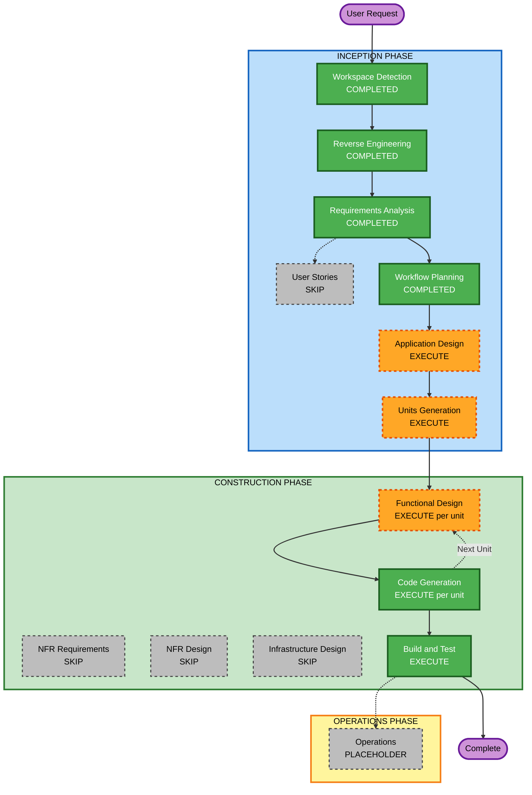

# Execution Plan — BattleTrisRs

## Detailed Analysis Summary

### Transformation Scope
- **Transformation Type**: Full system port — C++ (X11/Motif, POSIX-only) → Rust (SDL2, cross-platform)
- **Primary Changes**: Every subsystem replaced: rendering, game engine, networking, database, AI, server
- **Source of Truth**: BattleTris/usr/src/ (C++ reference implementation; read only, never modified)
- **Target**: New Rust workspace at the repo root

### Change Impact Assessment
- **User-facing changes**: Yes — new renderer (SDL2 vs Motif); modern clean 2D visual style; same gameplay
- **Structural changes**: Yes — new Cargo workspace with 3+ crates replacing autoconf/make
- **Data model changes**: Yes — Rust structs for Board, Piece, Weapon, Score replacing C++ classes
- **API changes**: Yes — new network protocol serialization (serde+bincode replacing ad-hoc binary framing)
- **NFR impact**: Yes — cross-platform (adds Windows); safe Rust (no unsafe except SDL2 FFI)

### Risk Assessment
- **Risk Level**: High
- **Rollback Complexity**: Easy (original C++ source untouched; new code isolated in Rust workspace)
- **Testing Complexity**: Complex — 18 piece types × 4 rotations × weapon state interactions; cross-platform build

---

## Workflow Visualization



### Text Alternative

```
INCEPTION PHASE
  [x] Workspace Detection      — COMPLETED
  [x] Reverse Engineering      — COMPLETED
  [x] Requirements Analysis    — COMPLETED
  [ ] User Stories             — SKIP (features fully specified)
  [x] Workflow Planning        — COMPLETED
  [ ] Application Design       — EXECUTE (6 new Rust modules to design)
  [ ] Units Generation         — EXECUTE (3 units matching FR-8 phases)

CONSTRUCTION PHASE (per unit loop x3)
  [ ] Functional Design        — EXECUTE (complex data models per unit)
  [ ] NFR Requirements         — SKIP (all NFRs pinned in requirements)
  [ ] NFR Design               — SKIP (NFR Requirements skipped)
  [ ] Infrastructure Design    — SKIP (desktop game, no cloud infra)
  [ ] Code Generation          — EXECUTE (always)
  [ ] Build and Test           — EXECUTE (always, after all units)

OPERATIONS PHASE
  [ ] Operations               — PLACEHOLDER
```

---

## Phases to Execute

### INCEPTION PHASE

- [x] Workspace Detection — **COMPLETED**
- [x] Reverse Engineering — **COMPLETED** (9 artifacts, ~155 C++ files analyzed)
- [x] Requirements Analysis — **COMPLETED** (8 FRs, 4 NFRs, 3-phase build order)
- [ ] User Stories — **SKIP**
  - *Rationale*: Feature set fully specified in requirements; two clear personas (human player, AI opponent); no UX ambiguity requiring story decomposition
- [x] Workflow Planning — **COMPLETED** (this document)
- [ ] Application Design — **EXECUTE**
  - *Rationale*: New greenfield Rust codebase with 6 major modules (`engine`, `renderer`, `weapons`, `ai`, `server`, `db`). Component boundaries, trait hierarchies (Piece trait, Weapon trait), inter-module interfaces, and crate dependency graph must be defined before code generation begins. The piece polymorphism system (18 types), weapon effect dispatch, and network message types each benefit from design-first planning.
- [ ] Units Generation — **EXECUTE**
  - *Rationale*: FR-8 explicitly defines 3 build phases, making units a natural decomposition. Multiple crates and clear sequential dependencies (engine before weapons, weapons before networking) justify a formal units breakdown.

### CONSTRUCTION PHASE

Per-unit loop executes 3 times (one per unit):

- [ ] Functional Design — **EXECUTE** (per unit)
  - *Rationale*: Each unit introduces significant new data models and business logic (board state machine, weapon effect system, network protocol) that benefit from a design artifact before code generation
- [ ] NFR Requirements — **SKIP**
  - *Rationale*: All NFRs fully specified in requirements.md — SDL2 chosen, serde+bincode chosen, safe Rust specified, unit tests required. No tech stack decisions remain open.
- [ ] NFR Design — **SKIP**
  - *Rationale*: NFR Requirements skipped; no NFR patterns need architectural embedding
- [ ] Infrastructure Design — **SKIP**
  - *Rationale*: Desktop game + LAN server; no cloud infrastructure, no CDK/Terraform/AWS services
- [ ] Code Generation — **EXECUTE** (per unit, always)
- [ ] Build and Test — **EXECUTE** (after all 3 units, always)

### OPERATIONS PHASE

- [ ] Operations — **PLACEHOLDER** (future deployment/monitoring workflows)

---

## Units of Work

### Unit 1: core-engine
**Scope**: Core Tetris engine + SDL2 rendering — single-player playable
**Crates**: `battletris-engine` (lib), `battletris-client` (bin)
**Deliverables**:
- Board struct (10×28), occupied/fill/clear/line-check logic
- All 18 piece types (Piece trait + 18 implementors) with rotation matrices
- Funds accumulation (die pip sum, happy-face bonus)
- Game loop driving piece drop, slide, placement
- SDL2 renderer: board, current piece, next-piece preview, score/funds display
- Unit tests: rotation correctness for all 18 pieces, line clearing, funds calculation

### Unit 2: weapons-and-ai
**Scope**: All 34 weapons, bazaar, arsenal, Ernie AI
**Crates**: `battletris-engine` extensions, `battletris-ai` (lib)
**Deliverables**:
- 34 `WeaponDef` constants compiled into Rust (names, descriptions, prices, durations from btweapons.db)
- Weapon effect application (board transformations, piece constraints, control changes)
- Arsenal management (up to 10 slots, number-key launch)
- Bazaar screen (SDL2 rendered, purchase flow, fund deduction)
- Ernie AI: exhaustive placement search, board scoring (hole penalty + height variance), weapon purchase strategy
- Unit tests: weapon effect correctness, bazaar fund arithmetic, AI piece placement scoring

### Unit 3: network-and-db
**Scope**: Relay server, two-player LAN client networking, player database, ELO
**Crates**: `battletris-server` (bin), network module in `battletris-client`
**Deliverables**:
- Relay server (tokio): accept two clients, pair them, relay game messages
- Game message serialization (serde+bincode): GameMessage enum covering all BTToken game-phase events
- Client networking: connect to server by IP:port, send/receive GameMessage
- Opponent board sync, weapon events, bazaar synchronization
- Player database (flat-file, serde+JSON or bincode): username, ELO, wins, losses
- ELO update after each ranked game
- Admin CLI (`btref` equivalent): list players, show stats
- Integration test: two clients + server on localhost play a full game

---

## Module Update Strategy
- **Update Approach**: Sequential — Unit 1 → Unit 2 → Unit 3
- **Critical Path**: engine (Unit 1) → weapons/AI (Unit 2) → networking (Unit 3)
- **Coordination Points**: `engine` crate is the shared foundation; Units 2 and 3 both depend on it
- **Testing Checkpoints**: After Unit 1 (single-player playable), after Unit 2 (local vs-AI playable), after Unit 3 (LAN two-player)
- **Rollback**: Each unit is additive; original C++ source always available as reference

---

## Success Criteria

- **Primary Goal**: Two machines (Mac + Windows) play a full BattleTris LAN game via relay server
- **Key Deliverables**: Rust workspace with 3+ crates; SDL2 client binary on Mac and Windows; relay server binary; player DB with ELO
- **Quality Gates**:
  - `cargo test --workspace` passes on macOS
  - `cargo test --workspace` passes (cross-compiled or on Windows)
  - Single-player vs Ernie completes a full game
  - Two-player LAN game completes (Mac vs Windows) with correct weapon effects
  - Player ELO updates after networked game
